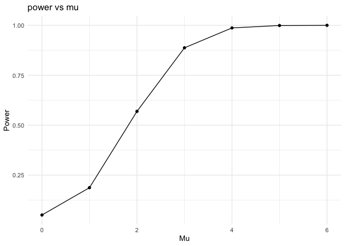

p8105_hw5_sl5685
================
Shumei Liu
2024-11-14

``` r
library(tidyverse)
```

    ## ── Attaching core tidyverse packages ──────────────────────── tidyverse 2.0.0 ──
    ## ✔ dplyr     1.1.4     ✔ readr     2.1.5
    ## ✔ forcats   1.0.0     ✔ stringr   1.5.1
    ## ✔ ggplot2   3.5.1     ✔ tibble    3.2.1
    ## ✔ lubridate 1.9.3     ✔ tidyr     1.3.1
    ## ✔ purrr     1.0.2     
    ## ── Conflicts ────────────────────────────────────────── tidyverse_conflicts() ──
    ## ✖ dplyr::filter() masks stats::filter()
    ## ✖ dplyr::lag()    masks stats::lag()
    ## ℹ Use the conflicted package (<http://conflicted.r-lib.org/>) to force all conflicts to become errors

``` r
library(rvest)
```

    ## 
    ## Attaching package: 'rvest'
    ## 
    ## The following object is masked from 'package:readr':
    ## 
    ##     guess_encoding

``` r
library(broom)
library(purrr)
set.seed(1)
```

## Problem 1

``` r
# Function to check if at least two people share a birthday
duplicate_birthday = function(n) {
  birthdays = sample(1:365, n, replace = TRUE)
  return(any(duplicated(birthdays)))
}
```

``` r
num_simulations = 10000
group_sizes = 2:50
probabilities = numeric(length(group_sizes))

# Loop through each group size and calculate the probability
for (i in seq_along(group_sizes)) {
  group_size = group_sizes[i]
  
  results = replicate(num_simulations, duplicate_birthday(group_size))
  
  probabilities[i] = mean(results)
}
```

``` r
data = data.frame(GroupSize = group_sizes, Probability = probabilities)

# Plot the probability
ggplot(data, aes(x = GroupSize, y = Probability)) +
  geom_line() +
  geom_point() +
  labs(title = "Probability of Shared Birthdays vs Group Size",
       x = "Group Size",
       y = "Probability of Shared Birthdays") +
  theme_minimal()
```

<!-- -->

## Probelm 2

``` r
# Generate datasets
dataset = function(n, mu, sigma) {
  rnorm(n, mean = mu, sd = sigma)
}
```

``` r
# perform t-test
t_test = function(data, alpha) {
  t_test_result = t.test(data, mu = 0)
  tidy_result = tidy(t_test_result)
  tidy_result$reject_null = tidy_result$p.value < alpha
  return(tidy_result)
}
```

``` r
# Simulation for 𝜇={0,1,2,3,4,5,6}
simulate_multiple_mu = function(n = 30, sigma = 5, mu_values = 0:6, 
                                n_simulations = 5000, alpha = 0.05) {
  
  results_list = list()

  for (mu in mu_values) {
    mu_hats = numeric(n_simulations)
    p_values = numeric(n_simulations)
    reject_nulls = logical(n_simulations)

    for (i in 1:n_simulations) {

      x = dataset(n, mu, sigma)
      
      tidy_result = t_test(x, alpha)
      mu_hats[i] = tidy_result$estimate
      p_values[i] = tidy_result$p.value
      reject_nulls[i] = tidy_result$reject_null
    }

    results_list[[paste0("mu_", mu)]] =
      data.frame(mu = mu, mu_hat = mu_hats, p_value = p_values, 
                 reject_null = reject_nulls)
  }

  return(do.call(rbind, results_list))
}

results = simulate_multiple_mu()
```

``` r
# Calculate the power of the test for each mu
power_results = results |>
  mutate(mu = as.numeric(mu)) |>
  group_by(mu) |>
  summarize(power = round(mean(reject_null), 4))
```

``` r
# Plot the power
ggplot(power_results, aes(x = mu, y = power)) +
  geom_line() +
  geom_point() +
  labs(title = "power vs mu",
       x = "Mu",
       y = "Power") +
  theme_minimal()
```

<!-- -->

There is a direct relationship between effect size and power: as the
effect size increases, the power of the test also increases, which means
that the test is more sensitive to detecting true effects.

``` r
# Calculate the average estimate of mu_hat for each mu value
average_mu_hat = results |>
  mutate(mu = as.numeric(mu)) |>
  group_by(mu) |>
  summarize(mu_hat = mean(mu_hat))

# Calculate the average estimate of mu_hat for samples where the null was rejected
average_mu_hat_rejected = results |>
  filter(reject_null == TRUE) |>
  mutate(mu = as.numeric(mu)) |>
  group_by(mu) |>
  summarize(mu_hat = mean(mu_hat))
```

``` r
average_mu_hat$group = "All Samples"
average_mu_hat_rejected$group = "Rejected Null"
combined_data = rbind(average_mu_hat, average_mu_hat_rejected)

ggplot(combined_data, aes(x = mu, y = mu_hat, color = group)) +
  geom_line(aes(linetype = group)) +
  geom_point() +
  labs(title = "Average Estimate of Mu Hat vs True Value of Mu",
       x = "True Value of Mu",
       y = "Average Estimate of Mu Hat",
       color = "Group",
       linetype = "Group") +
  theme_minimal() +
  scale_color_manual(values = c("All Samples" = "blue", "Rejected Null" = "red"))
```

<!-- -->

No. Due to selection bias, the sample mean of mu hat is not equal to the
true value of mu in the test that rejects the null hypothesis. Only
samples with large deviations from zero are included, which inflates the
mean estimate, especially when the true mean is small. As the true mean
increases, this bias decreases and the estimate becomes closer to the
actual value.

## Probelm 3

``` r
# Import data
homicides = read_csv("./data/homicide_data.csv")
```

    ## Rows: 52179 Columns: 12
    ## ── Column specification ────────────────────────────────────────────────────────
    ## Delimiter: ","
    ## chr (9): uid, victim_last, victim_first, victim_race, victim_age, victim_sex...
    ## dbl (3): reported_date, lat, lon
    ## 
    ## ℹ Use `spec()` to retrieve the full column specification for this data.
    ## ℹ Specify the column types or set `show_col_types = FALSE` to quiet this message.

There are 52,179 rows and 12 variables in the dataset. The data contains
records of homicides in various U.S. cities, including details like the
victim’s demographics, location of the homicide, and the case status
(e.g., closed or unsolved).

``` r
# Create a `city_state` variable
homicides_summary = homicides |>
  mutate(city_state = paste(city, state, sep = ", ")) |>
  group_by(city_state) |>
  summarise(
    total_homicides = n(),
    unsolved_homicides = sum(disposition %in% c("Closed without arrest", "Open/No arrest"))
  )
```

``` r
# Use `prop.test` for Baltimore, MD
baltimore_data = homicides_summary |>
  filter(city_state == "Baltimore, MD")

baltimore_test = 
  prop.test(baltimore_data$unsolved_homicides, baltimore_data$total_homicides)

baltimore_result = broom::tidy(baltimore_test)

baltimore_result
```

    ## # A tibble: 1 × 8
    ##   estimate statistic  p.value parameter conf.low conf.high method    alternative
    ##      <dbl>     <dbl>    <dbl>     <int>    <dbl>     <dbl> <chr>     <chr>      
    ## 1    0.646      239. 6.46e-54         1    0.628     0.663 1-sample… two.sided

``` r
# Perform prop.test for all cities
cities_tests = homicides_summary |>
  mutate(
    prop_test_result = map2(unsolved_homicides, total_homicides, ~ prop.test(.x, .y) |> broom::tidy())
  ) |>
  unnest(cols = prop_test_result)
```

    ## Warning: There was 1 warning in `mutate()`.
    ## ℹ In argument: `prop_test_result = map2(...)`.
    ## Caused by warning in `prop.test()`:
    ## ! Chi-squared approximation may be incorrect

``` r
# Create a plot with estimates and confidence intervals
cities_tests |>
  ggplot(aes(x = reorder(city_state, estimate), y = estimate)) +
  geom_point() +
  geom_errorbar(aes(ymin = conf.low, ymax = conf.high)) +
  coord_flip() +
  labs(
    title = "Proportion of Unsolved Homicides by City",
    x = "City, State",
    y = "Proportion of Unsolved Homicides"
  ) +
  theme_minimal()
```

<!-- -->

The plot shows the proportion of unsolved homicides across U.S. cities,
with confidence intervals for each estimate. Cities like Chicago, New
Orleans, and Baltimore have high unsolved rates, while others like
Tulsa, AL, have much lower rates, highlighting disparities in case
resolution.
